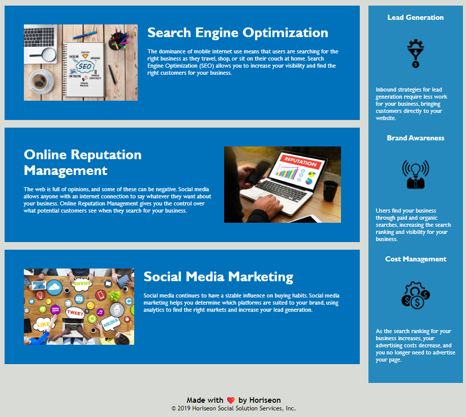

# Horiseon Marketing Media Management

Horison Marketing Media Management is a website that focuses on issues regarding Online reputation management, social media marketing, and search engine optimization. There are also lead generation lead-points, brand awareness, and cost management information pieces. There are three links at the time along with the Hori(seo)n header that will -eventually- lead to the corresponding sites. 

Through the project assignment, we were directed to change aspects of this site into sematic HTML elements, makesure that the CSS code is organized to follow the flow of HTML, and to add alts for proper accessibility features. 

